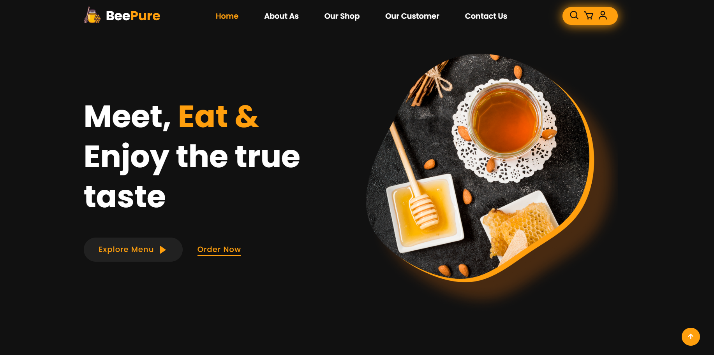

# 🍯 BeePure - Premium Honey E-Commerce Landing Page



BeePure adalah sebuah landing page modern untuk toko madu premium yang dirancang dengan fokus pada **UI/UX yang responsif**, performa yang cepat, dan pengalaman pengguna yang interaktif. Proyek ini dibangun untuk mendemonstrasikan kemampuan desain front-end dan logika antarmuka pengguna.

---

## 🚀 Fitur Utama

* **Responsive Design**: Tampilan yang optimal di berbagai perangkat (Desktop, Tablet, dan Mobile).
* **Identity Branding**: Logo kustom dengan skema warna oranye (#ff9f0d) yang ikonik.
* **Authentication System**: Fitur Login dan Register menggunakan `localStorage` untuk menyimpan data user (Session-based).
* **Interactive Shopping Cart**: Sidebar keranjang belanja untuk manajemen produk tanpa refresh.
* **Real-time Search**: Overlay pencarian untuk navigasi cepat antar section website.
* **Review Slider**: Section testimoni pelanggan dengan fitur horizontal scroll dan *scroll-snap*.
* **Smooth Animations**: Animasi muncul yang halus menggunakan library **ScrollReveal**.

---

## 🛠️ Teknologi yang Digunakan

* **HTML5**: Struktur web semantik.
* **CSS3**: Custom styling, Flexbox, Grid, dan Media Queries.
* **JavaScript (Vanilla)**: Logika sistem login, keranjang, dan manipulasi DOM.
* **Boxicons**: Ikonografi untuk elemen antarmuka.
* **ScrollReveal.js**: library animasi berbasis scroll.
* **Google Fonts**: Font 'Poppins' & 'Lato'.

---

## 📂 Struktur Proyek

```text
BeePure/
├── img/                # Aset gambar, logo, dan produk
├── index.html          # File utama (Struktur)
├── style.css           # File desain (Styling & Responsivitas)
├── main.js             # Logika interaktif (JavaScript)
└── README.md           # Dokumentasi proyek